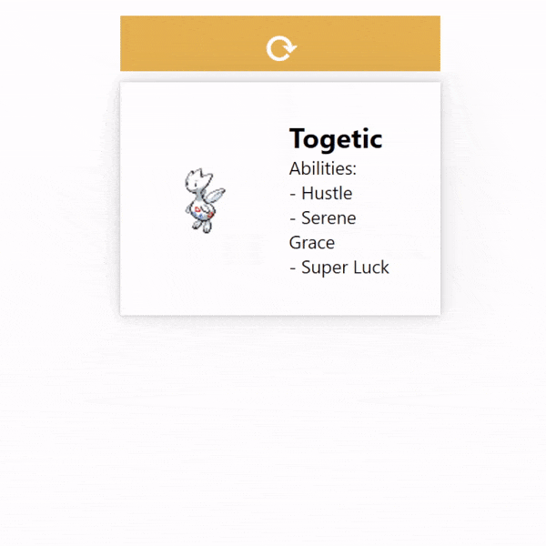

# Random Pokemon Generator

## What I Learned

- How to use Axios to make GET requests to an API.
- Handling API responses and extracting relevant data.
- Enhanced understanding of React components and state management.

## Technologies Used

- React
- Axios
- HTML
- CSS

## Usage

To get a local copy of the project, follow these steps:

- Clone the repository: git clone `https://github.com/flavioramses/react-pokemonPractice.git`
- Navigate to the project directory: `cd react-pokemonPractice`
- Install the dependencies: `npm install`
- Run the application: `npm start`
- Open your web browser and visit `http://localhost:3000`
- Click on the ⟳ button to generate a random Pokemon
- The Pokemon card with its name and abilities will be displayed on the screen
